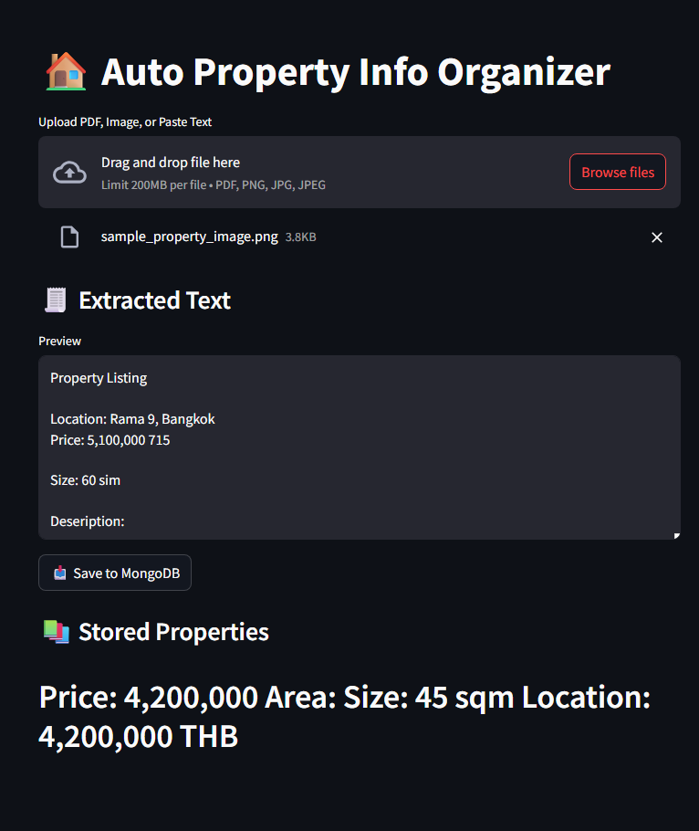
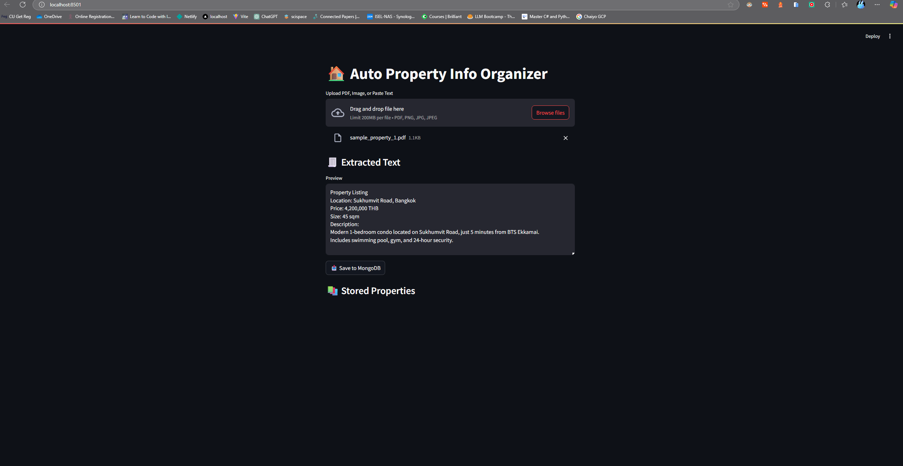
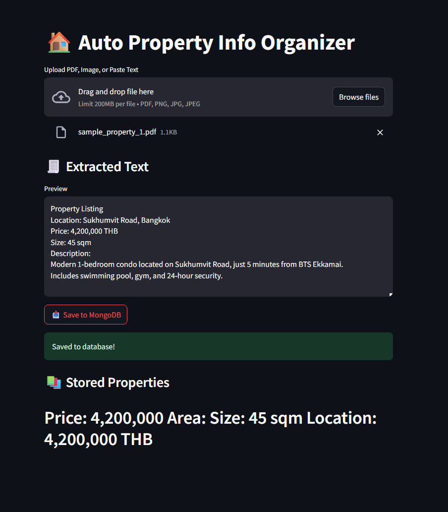
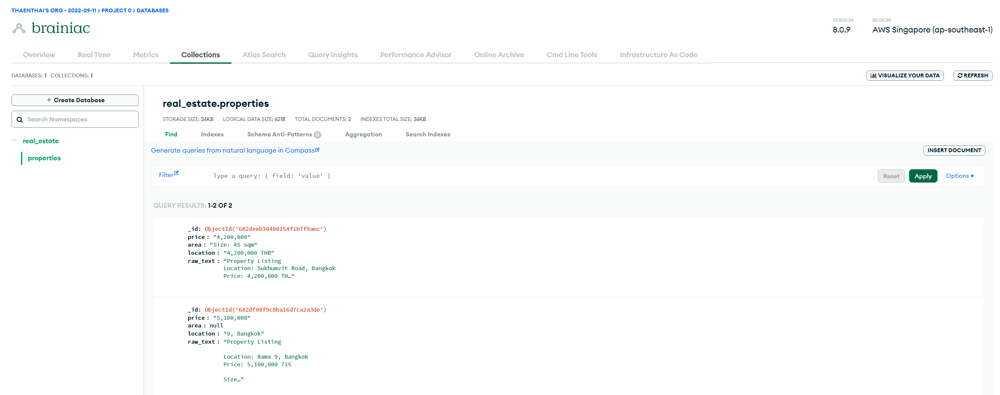

# 🏠 Auto Property Info Organizer

A lightweight AI-assisted web app that helps real estate agents organize and extract key information from messy property files — like **PDF brochures** and **property snapshots (images)** — and automatically stores the results in **MongoDB**.

Built using **Streamlit**, **Python**, **pytesseract**, and **PyMuPDF** — and it's 100% FREE.

---

## 🔧 Features

### ✅ Supported Input Types

| Type   | Description                            | Method Used     |
|--------|----------------------------------------|-----------------|
| PDF    | Property brochures, exported listings  | `PyMuPDF`       |
| Image  | Scanned paper listings, snapshots      | `pytesseract`   |

> ⚠️ Plain `.txt` paste is technically possible but **not currently supported in this version**.

---

### 📥 File Upload & Text Extraction

Users can upload `.pdf` or `.png/.jpg` files via drag-and-drop or browser selector.

📸 Example: Uploading a property image  


📄 Example: Uploading a PDF brochure  


---

### 🤖 Auto Field Classification

Once the text is extracted, the system uses **regular expressions** to identify and extract:

- 📍 `Location`
- 💰 `Price`
- 📐 `Size / Area`
- 📄 `Full raw text` for reference

You can view the extracted content immediately before saving.

---

### 💾 MongoDB Integration

The structured data is stored into a **MongoDB Atlas collection** using `pymongo`. All saved entries are displayed in the UI for easy access.

💾 Example: Saving data to MongoDB  


📚 Example: Viewing stored property entries  


---

## 🛠 Tech Stack

- [Streamlit](https://streamlit.io/) - Frontend
- `pymupdf` - PDF text extraction
- `pytesseract` - OCR for image files
- `pymongo` - MongoDB integration
- `re` - Regex-based field parsing
- MongoDB Atlas (Free Tier)

---

## 🚀 How to Run

1. Clone this repo
2. Create a virtual environment
3. Install dependencies

```bash
pip install -r requirements.txt
```

4.Add your MongoDB URI to app.py
5.Launch the app:

```bash
streamlit run app.py
```

Visit <http://localhost:8501>

📌 To-Do (Future Work)
✅ Add support for plain .txt or pasted content

✅ Improve AI field classification using GPT

❌ Add support for .docx and .xlsx

❌ Deploy to cloud (e.g., HuggingFace or Streamlit Cloud)

🙌 Made with ❤️ for real estate productivity.

---

<div align="center">
  
  <br>
  <strong>Made with ❤️ by <a href="https://github.com/neahtSan">neahtSan</a></strong>
</div>
